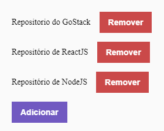

# GoStack-Desafio02

Segundo desafio sugerido peo GoStack2020.

Nesse segundo desafio realizamos a junção do nosso backend criado no primeiro desafio com um novo frontend.

O nosso frontend deve se conectar com o backend e realizar a listagem, cadastro e exclusão de dados.

:smiley: Como ficou: 

Link do que foi solicitado:
https://github.com/Rocketseat/bootcamp-gostack-desafios/tree/master/desafio-conceitos-reactjs
